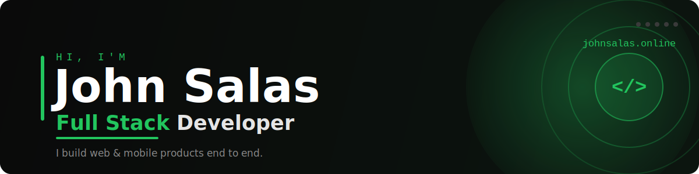

  

## Hey, I'm John! 👋

  
  
  
  

### 🚀 About me

- 🔭 Full Stack Developer working as a **freelancer**, building complete products for clients.
- ⚡ I enjoy turning real problems into clean, well-crafted software.
- 🌱 Currently leveling up: **advanced TypeScript**, testing (Vitest / Playwright), architecture & patterns, and **Docker in production**.
- 💬 Ask me about **React, Next.js, FastAPI or Flutter**.

### 🛠️ Tech Stack

**Frontend**

**Backend**

**Databases**

**Mobile**

**Tools**

### 📌 Featured Projects

**[🍽️ Restaurant Management System](https://github.com/jsalas607/project_manhattan)** — Full-stack
A complete platform to run a restaurant: tables, orders, kitchen dispatch, inventory and staff, with role-based auth and **real-time sync over WebSockets**.
`Python` · `FastAPI` · `PostgreSQL` · `Flutter`

**[🎮 Rock, Paper, Scissors, Lizard, Spock](https://github.com/jsalas607/rock-paper-scissors-lizard-spock)** — Frontend + real-time
Interactive 8-bit web game with single-player and **real-time multiplayer**. [▶️ Play it live](https://juego.johnsalas.online)
`Next.js` · `React` · `Firebase`

**[🌶️ Spicy Card](https://github.com/jsalas607/spicy_card)** — Mobile
Cross-platform party-game app of dares, with difficulty levels and region-localized content.
`Flutter` · `Dart`

> 👉 See all of it, live, on my **[portfolio](https://johnsalas.online)**.

### 📊 GitHub Stats

  
  

  

<i>Let's build something together 🚀</i>

